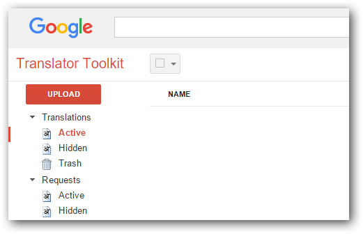
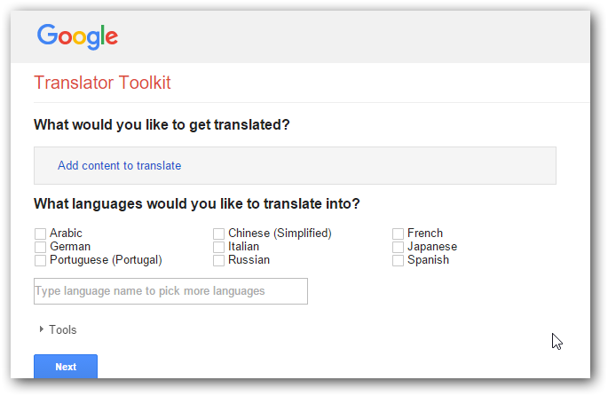
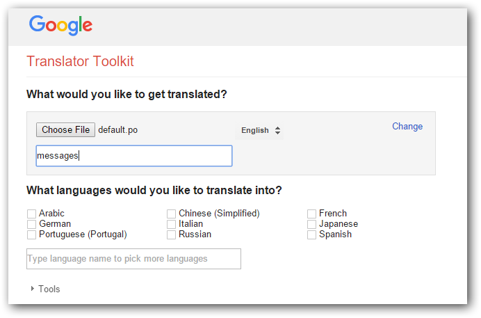
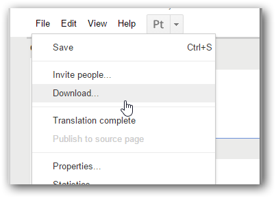
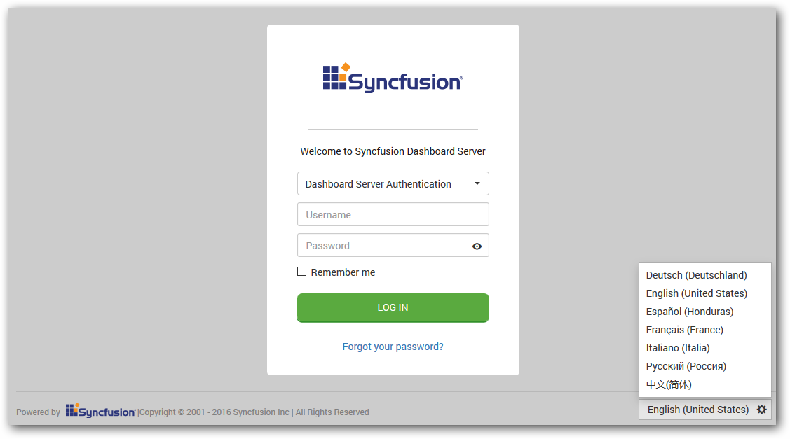

#Adding new localizations

Create your own culture texts for the Syncfusion Dashboard Server and add it in the application anytime.

To make Syncfusion Dashboard Server use a different culture perform the following steps:

1. Open [Google Translator Kit](https://translate.google.com/toolkit). Click on Upload button.

    

    It will open a new window to upload the existing culture file en-us. Then click on `Add content to translate` link in the screen.
    
    
 
2. Select `Upload file` option in the dropdown.

    
 
3. Upload [default.po](locale/default.po) file which contains the texts from the Dashboard Server application from `~Installed Location~/Dashboard Server/DashboardServer.Web/locale into google translator`.

4. Make sure that the source language is in English and file name as `messages` as in the below image.

    
    
    Select your desire language in the listed language and click `Next`.
    
5. In the next screen, select `Start Order`, if you need paid service on translation; otherwise select `No, thanks`.

    
 
6. The uploaded file will be listed in home page of translator kit. Click on the file to open it and make any corrections in the translation if needed.

    
 
7. Click on `Complete` on the right-top corner of the page to complete the translation.

    
 
8. Download your translated `messages.po` file.

    
 
9. Create a folder in `~Installed Location~/Dashboard Server/DashboardServer.Web/locale` with {language code}-{country code} and paste the downloaded messages.po file inside the newly created folder.

    For example, if you are translating to Italian, create a folder named `it-it` and paste the messages.po like the below.
    
    `~Installed Location~/Dashboard Server/DashboardServer.Web/locale/it-it/messages.po`
    
    Newly added language will be listed in language list in Dashboard Server after refreshing the page in the Dashboard Server.
    
    